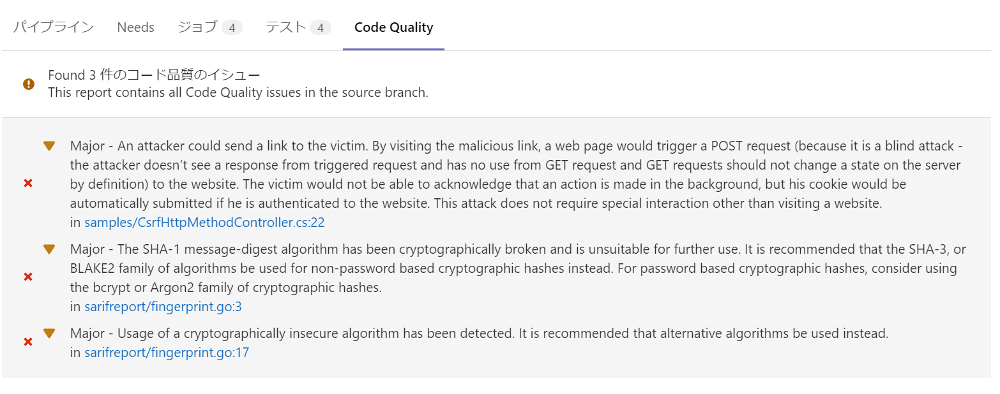

# CodeQuality Converter
Convert report from SARIF to GitLab Code Quality.


## Usage
Linux only!


### Install
```shell
$ wget -O codequality-converter https://gitlab.com/ignis-build/codequality-converter/-/releases/permalink/latest/downloads/bin/codequality-converter-linux
$ chmod +x codequality-converter
```


### Run
Run a static analysis tool such as [Semgrep](https://semgrep.dev/).

```shell
$ semgrep --config=auto --sarif --output=semgrep.sarif .
```

Convert to GitLab Code Quality json.

```shell
$ ./codequality-converter semgrep.sarif gl-code-quality-report.json
```

Conver to GitLab SAST json.

```
$ ./codequality-converter --type sast semgrep.sarif gl-sast-report.json
```


### Run in GitLab CI
```yaml
codequality:sast:
  image: $CI_TEMPLATE_REGISTRY_HOST/security-products/semgrep:3
  before_script:
    - wget -O codequality-converter https://gitlab.com/ignis-build/codequality-converter/-/releases/permalink/latest/downloads/bin/codequality-converter-linux
    - chmod +x codequality-converter
  script:
    - /analyzer run
    - ./codequality-converter semgrep.sarif gl-code-quality-report.json
  artifacts:
    reports:
      codequality: gl-code-quality-report.json
```




## License
MIT
